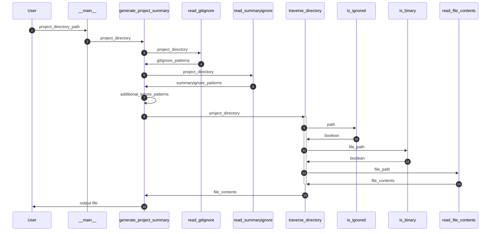
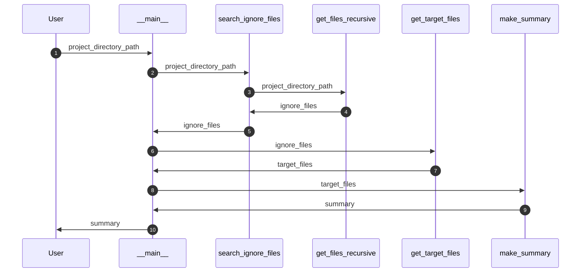
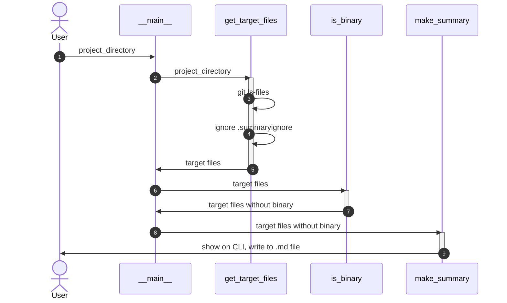

# 現状関数
- is_binary
  - ファイルのバイナリ判定
- read_file_contents
  - ファイルの内容読み込み
- is_ignored
  - ファイルの無視判定
- read_gitignore
  - .gitignoreの読み込み
- read_summaryignore
  - .summaryignoreの読み込み
- generate_project_summary
  - プロジェクトの要約生成

## 構成図

# 新しいapp
- search_ignore_files
  - .summaryignoreの読み込み
  - .gitignoreの読み込み
  - それぞれ再帰的に読み込み
- get_target_files
  - フィルタリングして、対象ファイル一覧を取得
- make_summary
  - .mdに書き出し
- is_binary
  - ファイルのバイナリ判定

## ボツ
- get_target_files
  - フィルタリングして、対象ファイル一覧を取得
- make_summary
  - .mdに書き出し
- is_binary
  - ファイルのバイナリ判定

## 構成図

### ボツ

